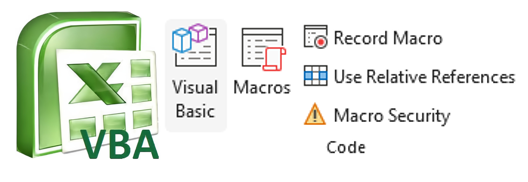
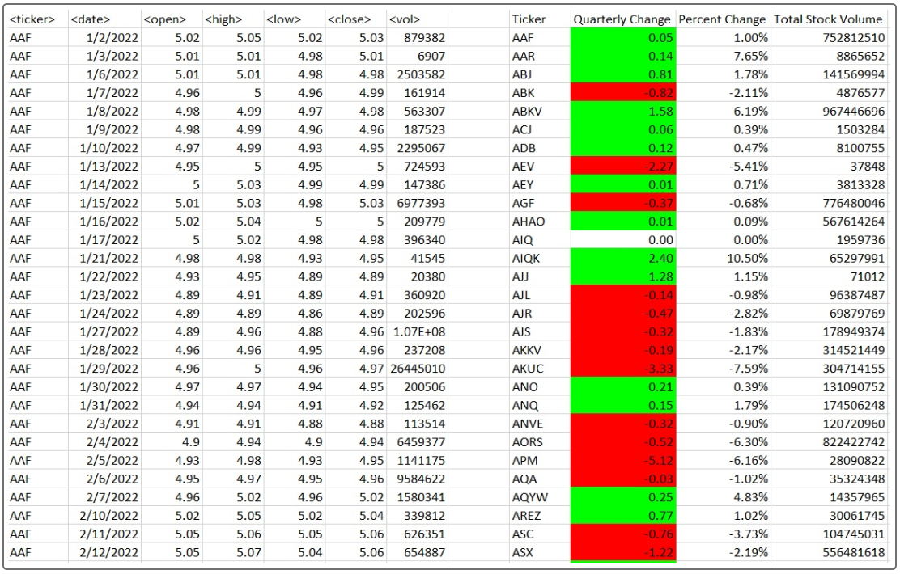
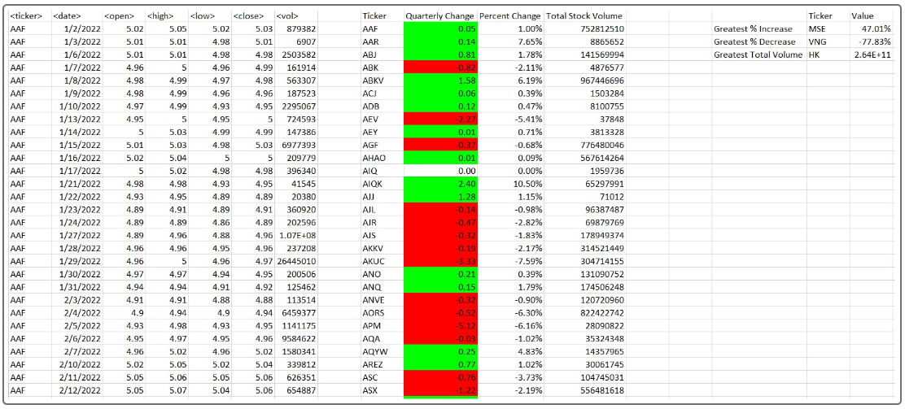

VBA Scripting
===
Objetive
---
The main objective of this project is to use the VBA (Visual Basic for Applications) for an exercise in Excel is to use scripts or codes to connect different Excel workbooks and simultaneously perform an analysis. 

For this homework assignment, we will use VBA scripting to analyze generated stock market data.

Instructions
---
Create a script that loops through all the stocks for each quarter and outputs the following information:

- The ticker symbol

- Quarterly change from the opening price at the beginning of a given quarter to the closing price at the end of that quarter.

- The percentage change from the opening price at the beginning of a given quarter to the closing price at the end of that quarter.

- The total stock volume of the stock. The result should match the following image:

- Add functionality to your script to return the stock with the "Greatest % increase", "Greatest % decrease", and "Greatest total volume". The solution should match the following image:

Make the appropriate adjustments to your VBA script to enable it to run on every worksheet (that is, every quarter) at once.